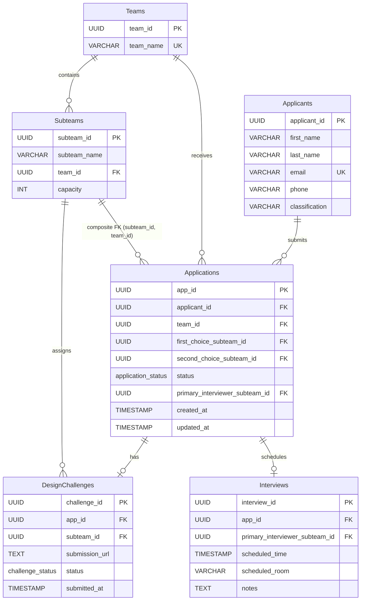

# AME27 Software Design Challenge

Database architecture and backend logic for Formula EV Design Challenge

## Deliverables

| # | Deliverable | File |
|---|-------------|------|
| 1 | Database Schema (ERD + SQL) | [`01-schema.sql`](.schema.sql) |
| 2 | Core Business Logic | [`02-selectForInterview.ts`](.selectForInterview.ts) |

## Key Design Decisions

- **Composite foreign keys** enforce that subteam choices belong to the correct team at the database level
- **Pessimistic locking** (`SELECT ... FOR UPDATE`) prevents both race condition scenarios atomically
- **Defense-in-depth authorization** with Express middleware + business logic validation

## Entity Relationship Diagram

> **Key constraint:** The composite foreign keys on `first_choice_subteam_id` and `second_choice_subteam_id` reference `subteams(subteam_id, team_id)`, ensuring the database rejects any subteam choice that doesn't belong to the application's team.
